*数据结构*即数据的组织形式，是适合计算机存储、管理和处理的数据逻辑结构，对空间数据而言，则是**地理实体的空间排列方式和相互关系**的抽象描述。

空间数据结构是地理信息系统沟通信息的桥梁，是数据逻辑模型与数据文件格式之间的桥梁，分为**矢量空间数据结构**和**栅格空间数据结构**。

在地理信息系统中描述地理要素和地理现象的空间数据包括**空间位置**、**拓扑关系**和**属性**三个方面的内容。
## 3.1 矢量数据结构
### 3.1.1 定义
矢量数据结构即通过记录坐标点的方式尽可能精确表示点、线和多边形（面）等地理实体，坐标空间设为连续，允许任意位置、长度和面积的精确定义。
### 3.1.2 特点
矢量空间数据结构具有以下特点：
- 定位明显、属性隐含
- 在计算长度、面积，形状和图形编辑、几何变换等操作中具有高效率和精度，但在叠加运算、领域搜索等操作时比较困难
- 图形运算的算法比栅格数据结构复杂，甚至难以实现
### 3.1.3 获取方式与组织形式
矢量数据可以由外业测量或者跟踪数字化来获得，或者从栅格数据矢量化而来。

在组织矢量数据时，通过【标识码】-【属性】-【几何位置】的形式存储在数据库中，对于不同要素的几何位置，可以对点、线、面进行独立编码，也可以采用点位字典的方式，将点记录成点号文件，线和面表示为点号串。
### 3.1.4 编码方式
#### 3.1.4.1 实体数据结构/spaghetti数据结构
##### 3.1.4.1.1 实体式
###### 3.1.4.1.1.1 概念
是指构成多边形边界的各个线段，以多边形为单元进行组织。坐标边界数据和多边形单元实体一一对应，各多边形边界都单独编码和数字化。
###### 3.1.4.1.1.2 表示方法
**多边形原始数据**
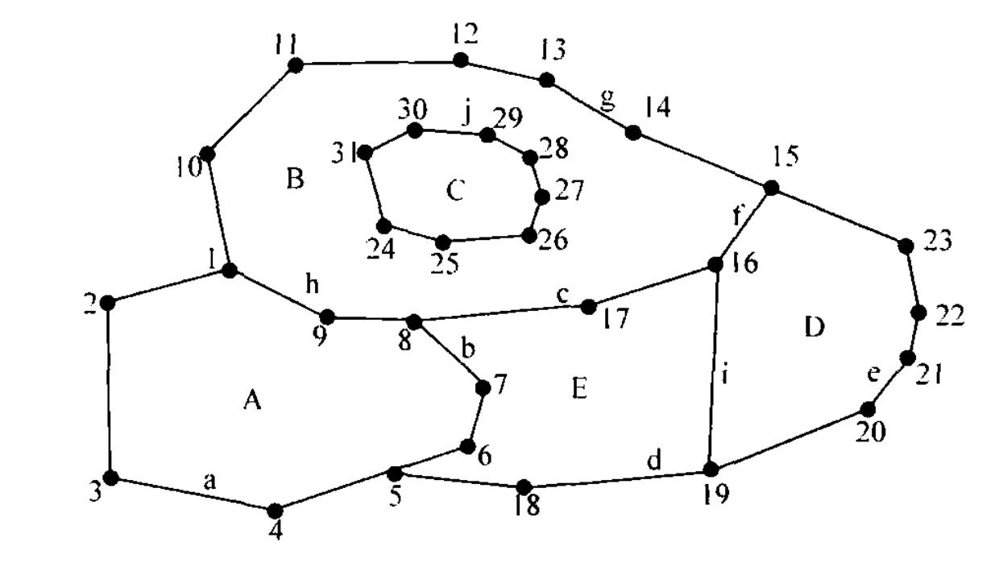
**多边形数据文件**

| 多边形ID | 数据项（坐标）                                                                                                                                                                   |
| :---: | ------------------------------------------------------------------------------------------------------------------------------------------------------------------------- |
|   A   | $(x_1,y_1),(x_2,y_2),(x_3,y_3),(x_4,y_4),(x_5,y_5),(x_6,y_6),(x_7,y_7),(x_8,y_8),(x_9,y_9),(x_1,y_1)$                                                                     |
|   B   | $(x_1,y_1),(x_9,y_9),(x_8,y_8),(x_{17},y_{17}),(x_{16},y_{16}),(x_{15},y_{15}),(x_{14},y_{14}),(x_{13},y_{13}),(x_{12},y_{12}),(x_{11},y_{11}),(x_{10},y_{10}),(x_1,y_1)$ |
|   C   | $(x_{24},y_{24}),(x_{25},y_{25}),(x_{26},y_{26}),(x_{27},y_{27}),(x_{28},y_{28}),(x_{29},y_{29}),(x_{30},y_{30}),(x_{31},y_{31}),(x_{24},y_{24})$                         |
|   D   | $(x_{19},y_{19}),(x_{20},y_{20}),(x_{21},y_{21}),(x_{22},y_{22}),(x_{23},y_{23}),(x_{15},y_{15}),(x_{16},y_{16}),(x_{19},y_{19})$                                         |
|   E   | $(x_{5},y_{5}),(x_{18},y_{18}),(x_{16},y_{19}),(x_{16},y_{16}),(x_{17},y_{17}),(x_{8},y_{8}),(x_{7},y_{7}),(x_{7},y_{7}),(x_{6},y_{6}),(x_{5},y_{5})$                     |
或者
**点号文件&多边形文件**

| 点ID | 坐标        | 多边形ID（在另一文件中） |               点号串               |
| :-: | --------- | :-----------: | :-----------------------------: |
|  1  | $x_1,y_1$ |       A       |       1,2,3,4,5,6,7,8,9,1       |
|  2  | $x_2,y_2$ |       B       | 1,9,8,17,16,15,14,13,12,11,10,1 |
| ... | ...       |      ...      |               ...               |
|  n  | $x_n,y_n$ |      ...      |               ...               |
###### 3.1.4.1.1.3 特点
**优点**
- 编码容易
- 数字化操作简单
- 数据编排直观
**缺点**
- 相邻多边形的公共边界要被数字化和存储两遍，造成数据冗余存储；还容易造成数据的不一致，引起严重的匹配误差，导致输出的公共边界出现间隙或重叠
- 每个多边形自成体系，缺少多边形的领域信息和图形拓扑关系
- 岛只作为一个单图形，没有建立与外界多边形的联系
- 难以检查多边形边界的拓扑关系正确与否，比如是否存在间隙、不完整的多边形或者拓扑学上不能接受的环等问题
#### 3.1.4.2 拓扑空间数据结构
##### 3.1.4.2.1 拓扑空间结构的共同特点
拓扑空间数据结构没有固定的格式，还没有形成标准，但基本原理相同。
点是相互独立的，点连成线，线构成面；每条线始于起始节点，止于终止节点，并于左右多边形相互邻接。
##### 3.1.4.2.2 索引式
###### 3.1.4.2.2.1 概念
采用树状索引以减少数据冗余并间接增加领域信息，具体方式是对所有边界点进行数字化，将坐标对以顺序方式存储，由点索引与边界线号相联系，以线索引与各多边形相联系，形成树状索引结构。
###### 3.1.4.2.2.2 表示方法
**多边形原始数据与树状索引图**
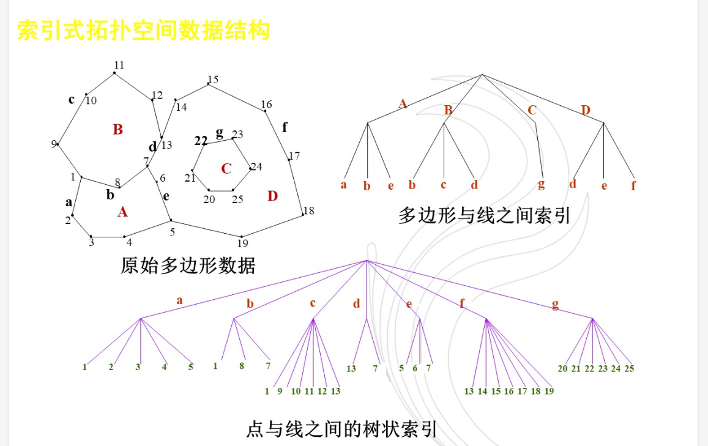
**多边形、线、点数据文件**

###### 3.1.4.2.2.3 特点
**优点**
- 消除了多边形边界数据冗余和不一致的问题
- 在简化过于复杂的边界线或合并多边形时可不必改造索引表
- 邻域信息和岛状信息可以通过对多边形文件的线索引处理得到
**缺点**
- 邻域信息和岛状信息的获取处理繁琐，给领域函数运算、消除无用边、处理岛状信息以及检查拓扑关系等带来一定的困难
- 两个编码表都要以人工方式来建立，工作量大且容易出错
##### 3.1.4.2.3 双重独立式编码(DIME)
###### 3.1.4.2.3.1 概念
是对图上网状或面状的要素的任意一条线段，用其两端的节点及相邻面域来定义
###### 3.1.4.2.3.2 表示方法
**多边形原始数据**
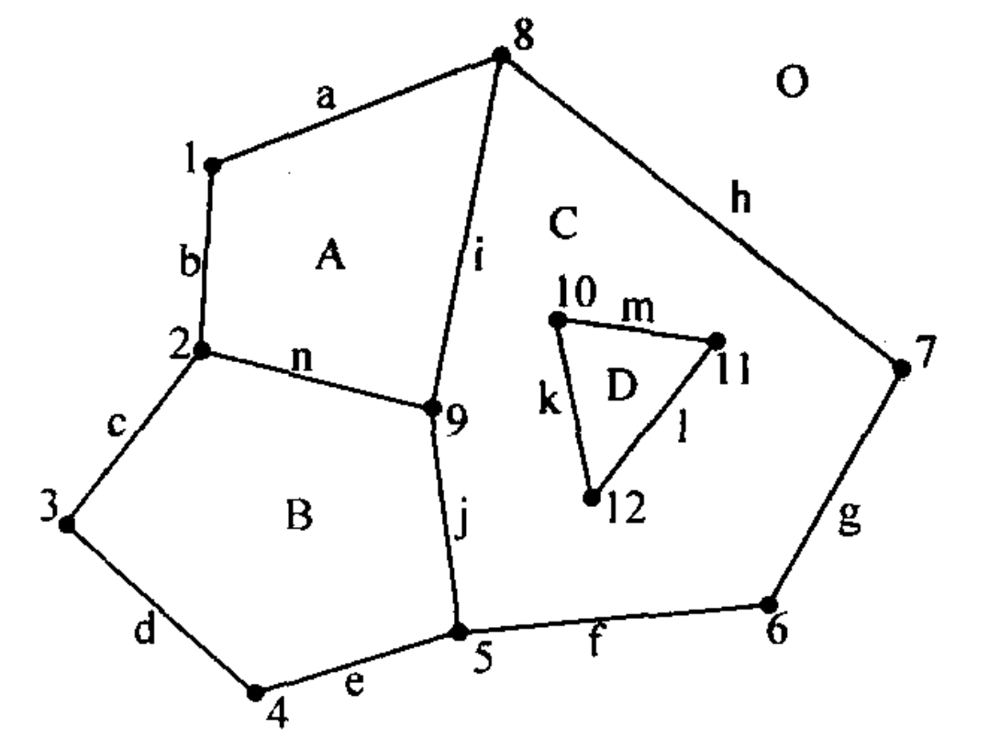
**线文件数据**
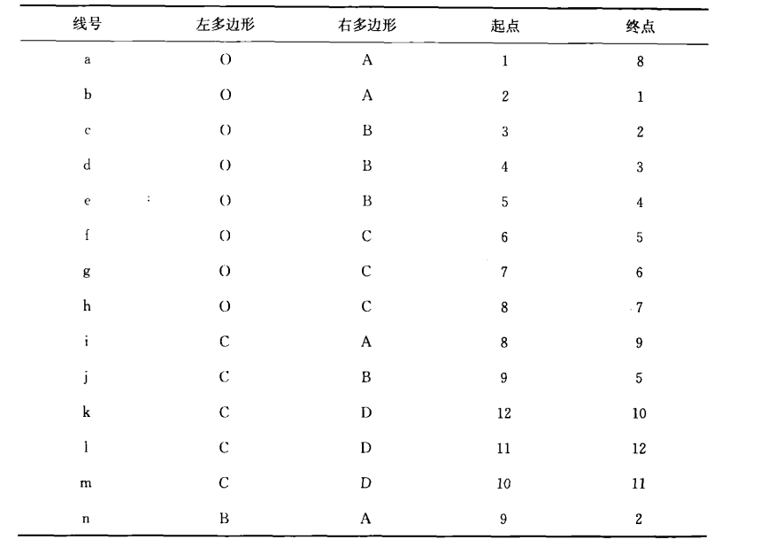
此时，就可以配合点文件通过上述的关系来生成面文件。
###### 3.1.4.2.3.3 特点
**优点**
- 可以有效地进行数据存储正确性检查，同时便于对数据进行更新和检索
- 可以达到数据自动编辑的目的
**缺点**
- 设计复杂、维护成本高等
##### 3.1.4.2.3 链状双重独立编码
###### 3.1.4.2.3.1 概念
是对DIME数据结构的一种改进，在DIME中，一条边只能用直线两端点的序号以及相邻的面域来表示，而在链状数据结构中，将若干直线合为一个弧段，每个弧段可以有许多中间点。
###### 3.1.4.2.3.2 表示方法
在链状双重独立数据结构中，主要由四个文件：多边形文件、弧段文件、弧段坐标文件、节点文件
**四种文件数据**
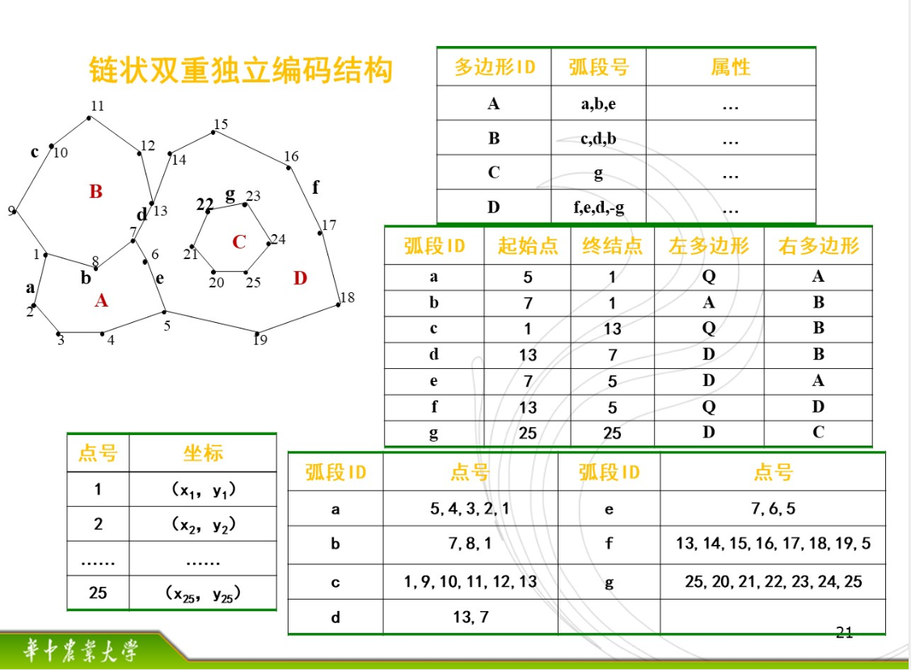
多边形文件也可以通过软件自动检索有关弧段自动生成

## 3.2 栅格数据结构
### 3.2.1 定义
栅格结构又称为网格(raster或grid cell)结构或像元(pixel)结构，是以规则的网格阵列来表示空间地物或现象分布的数据组织，组织中的每个数据表示地物或现象的非几何属性特征。
### 3.2.2 栅格单元的定义
一个完整的栅格模型需要栅格的形状、栅格单元尺寸大小/分辨率、栅格原点与栅格倾角。
在确定栅格单元的大小时，应能有效的逼近控件对象的分布特征，又减少数据的冗余度。
对于方格而言，一般采取$L=\frac{1}{2}\sqrt{S}$，其中S为最小多边形。
在确定单元值时，有三种方法：
- 点中心法
- 重要性法
- 面积占优法
### 3.2.3 图形表示
- 点：一个像元
- 线：在一定方向上连接成串的相邻像元集合
- 面：聚集在一起的相邻像元集合
### 3.2.4 特点
- 属性明显，定位隐含，数据直接记录属性的指针或属性本身
- 每个栅格的行列位置可以方便地依据其在文件中的记录位置得到，且行列坐标容易转为其他坐标系下的坐标
- 栅格结构表示的地表是不连续的，是量化和近似离散的数据
### 3.2.5 获取方式
- 在专题图上均匀划分网格，逐网格地确定其代码
- 航空、航天遥感数据
- 扫描仪对地图或其他图件的扫描获取
- 由矢量转换而来
- 网格化数据文件的转入
### 3.2.6 组织方式
#### 3.2.6.1 基于栅格方式
```
数据文件
|----- 栅格1
|       |------------ x坐标
|       |------------ y坐标
|       |------------ 层1属性值
|       |------------ ...
|       |------------ 层N属性值
|
|------ 栅格2
|
|------ ...
|
|------ 栅格N
```
#### 3.2.6.2 基于层方式
```
数据文件
|----- 层1
|       |------ 栅格1
|       |        |----- x坐标
|       |        |----- y坐标
|       |        |----- 属性值
|       |
|       |------ 栅格2
|       |        
|       |------ ...
|       |
|       |------ 栅格N
|
|------ 层2
|
|------ ...
|
|------ 层N
```
#### 3.2.6.2 基于面域方式
```
数据文件
|----- 层1
|       |------ 多边形1
|       |        |----- 属性值
|       |        |----- 栅格1坐标
|       |        |----- 栅格2坐标
|       |        |----- ...
|       |        |----- 栅格N坐标
|       |
|       |------ 多边形2
|       |        
|       |------ ...
|       |
|       |------ 多边形N
|
|------ 层2
|
|------ ...
|
|------ 层N
```
### 3.2.7 编码方式
#### 3.2.7.1 直接编码
将栅格数据看作一个数据矩阵，逐行或逐列逐个记录代码。
#### 3.2.7.2 压缩编码
##### 3.2.7.2.1 游程长度编码
###### 3.2.7.2.1.1 基本思想/概念
对一幅栅格图像，只在各行（或列）数据的代码发生变化时依次记录该代码及相同代码重复的个数
###### 3.2.7.2.1.2 表示方法
**记录重复代码及其重复数/长度**
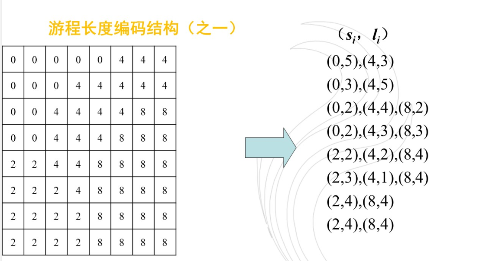
**记录重复代码及其终止位置**
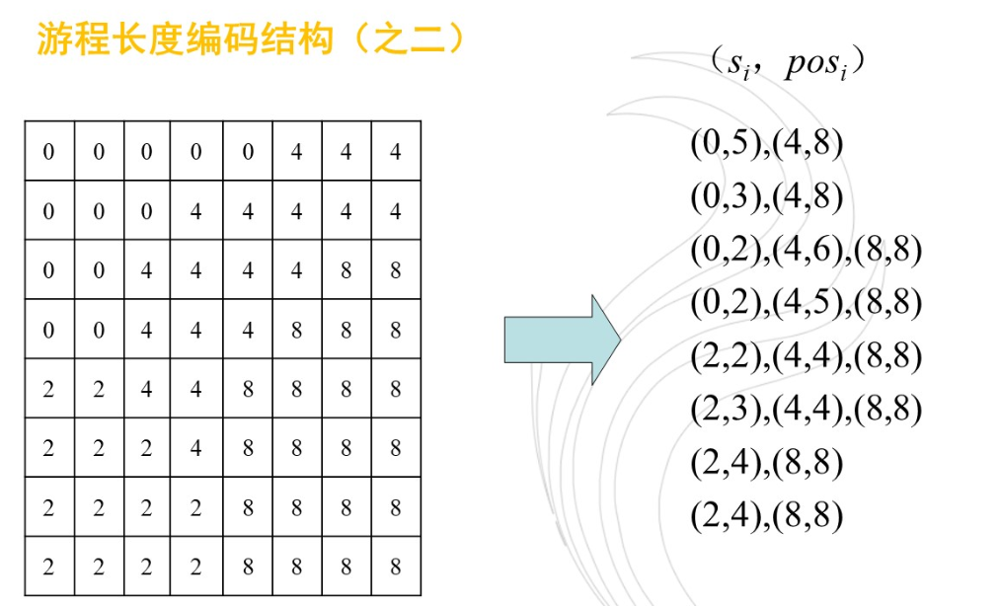
###### 3.2.7.2.1.3 特点
- 压缩方式有效且简便
- 压缩比的大小与图的复杂程度成反比，图件越简单，压缩效率越高
- 在栅格加密时数据量没有明显增加，压缩效率较高
- 易于检索、叠加合并等操作，运算简单
##### 3.2.7.2.2 四叉树编码
###### 3.2.7.2.2.1 基本思想/概念
将一幅栅格地图或图像等分为四个部分，逐块检查其格网属性值，如果每个子区的所有格网具有相同值，则这个子区就不再继续分割，否则将该子区再分割成四个子区，知道每个子块都含有相同的属性值。
###### 3.2.7.2.2.2 表示方法
**原始栅格数据与四叉树的树状表示**
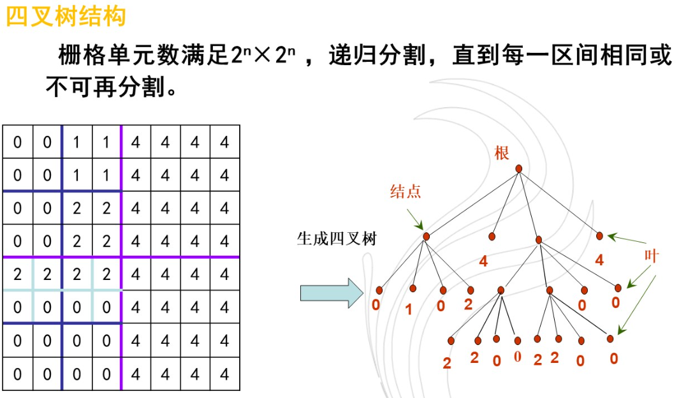
图像必须是$2^n\times 2^n$的栅格阵列，极限分割次数为n，四叉树的高度为n+1。
###### 3.2.7.2.2.3 特点
- 便于有效计算多边形的数量特征
- 阵列各部分的分辨率是可变的，边界复杂部分四叉树高，分辨率高；不需要表示细节的部分则四叉树低，这样既可精确表示图形结构又可减少存储量
- 简单栅格与四叉树之间的相互转换比其他压缩方法容易
- 对多边形中嵌套异类小多边形的表示方便
- 转换具有不确定性，同一形状和大小的多边形可能得出多种不同的四叉树结构，不利于形状分析和模式识别
##### 3.2.7.2.3 链式编码
###### 3.2.7.2.3.1 基本思想/概念
记录线状地物和面状地物的边界，将线状地物和面状地物的边界表示为由某一起始点开始并按某些基本方向确定的单位矢量链。基本方向定义为东=0，东南=1，南=2，西南=3，西=4，西北=5，北=6，东北=7等8个基本方向
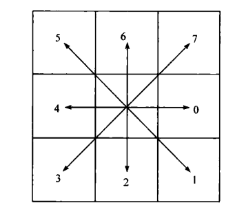
###### 3.2.7.2.3.2 表示方法
**链式编码表示**
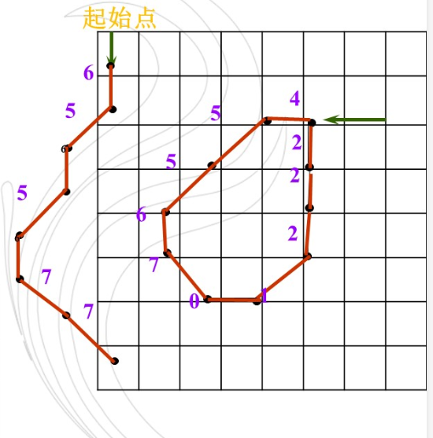
**链码结构文件**
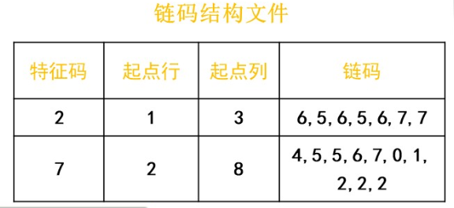
###### 3.2.7.2.3.3 特点
- 用来表示线状或面状地物具有很强的数据压缩能力
- 具有一定的运算功能，如面积和周长计算，探测边界急弯和凹进部分比较容易，较适于存储图形数据
- 对叠置运算难以实施
- 局部修改将改变整体结构，效率较低
- 相邻区域的边界被重复存储，产生冗余
##### \*3.2.7.2.4 块状编码
> TODO
## 3.3 矢量数据结构与栅格数据结构的比较与转化
### 3.3.1 两种数据结构的对比
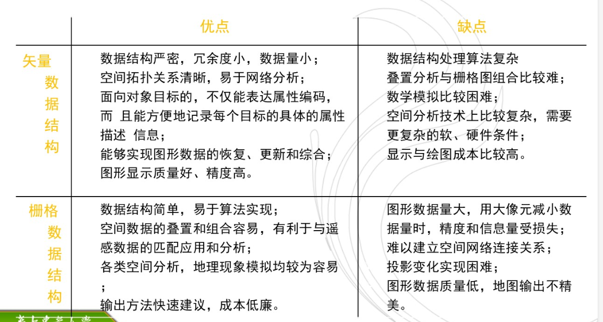

|  比较内容   | 矢量格式  | 栅格格式  |
| :-----: | :---: | :---: |
|   数据量   |   小   |   大   |
|  图形精度   |   高   |   低   |
|  图形运算   | 复杂、高效 | 简单、低效 |
| 遥感影像格式  |  不一致  | 一致或接近 |
|  输出表示   | 抽象、昂贵 | 直观、便宜 |
|  数据共享   | 不易实现  | 容易实现  |
| 拓扑和网络分析 | 容易实现  | 不易实现  |
### 3.3.2 矢量数据结构向栅格数据结构的转换
矢量数据转换成栅格数据后，图形的几何精度降低，所以选择的栅格的尺寸和大小要尽量满足精度要求。为了提高精度，要对栅格细化，但细化栅格数据量将以平方指数低增。因此精度和数据量是确定栅格大小最重要的影像因素。
#### 3.3.2.1 点的栅格化
只要点落在那个网格中就属于那个网格元素，其行列坐标i，j分别为：
$$i=1+Integer(\frac{y_{max}-y}{\Delta y})$$
$$j=1+Integer(\frac{x-x_{min}}{\Delta x})$$
#### 3.3.2.2 线的栅格化
- 直线插补法：依据起止点通过计算找到与落在直线中点的网格（或直线经过的中心网格），然后再找该网格与其两端网格的中心网格，直至直线填充完毕。
- 扫描线法
#### 3.3.2.3 面的栅格化
##### 3.3.2.3.1 种子填充法/内部点扩散法
##### 3.3.2.3.2 扫描线法

### 3.3.3 栅格数据向矢量数据结构的转换
#### 3.3.3.1 基于图像数据的矢量化方法
##### 3.3.3.1.1 二值化
线划图形扫描后产生栅格数据，按0~255的不同灰度值量度$G(i,j)$，设一个阈值$T$，$G(i,j)\geq T$则记录此栅格的值为1，否则为0
##### 3.3.3.1.2 细化
是消除线划横断面栅格数的差异，使每一条线只保留或代表其轴线或周围轮廓线位置的单个栅格的宽度。
在细化栅格时需要注意保留连通的栅格，方法是利用3\*3的栅格组合图：
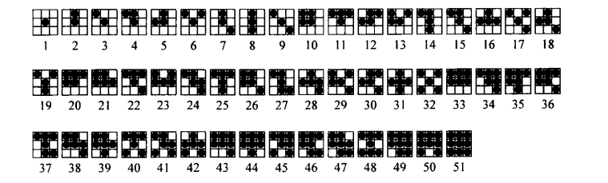
显然，只有2,3,4,5,10,11,12,16,21,24,28,33,34,35,38,42,43,46,50删去中心点后不会影响连通性。
这样，核查所有3\*3的栅格，确定中心点的保留与否后就可以得到细化处理的结果：
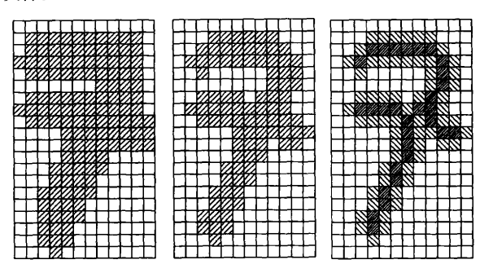
##### 3.3.3.1.3 跟踪
从图幅西北角开始，按顺时针或逆时针方向，从起始点开始，依据8个邻域进行搜索，依次跟踪相邻点，并记录节点坐标，然后搜索闭曲线，直到完成全部栅格数据的矢量化
#### 3.3.3.2 多边形边界提取
##### 3.3.3.2.1 边界线追踪
将写入数据文件的细化处理后的栅格数据，整理为从结点出发的线段或闭合的线条，并以矢量形式存储特征栅格点中心的坐标
##### 3.3.3.2.2 拓扑关系生成
对于矢量表示的边界弧段，判断其与原图上各多边形的空间关系，形成完整的拓扑结构，并建立与属性数据的联系
##### 3.3.3.2.3 去除多于点及曲线圆滑
由于搜索是逐栅格进行的，必须去除由此造成的多余点记录以减少冗余
## 3.4 栅格数据结构与矢量数据结构的选择
**矢量数据结构**是人们最熟悉的图形表达形式，对于线划地图来说，用矢量数据记录往往比栅格数据节省存贮空间；相互连接的线网络或多边形网络则只有矢量数据结构模式才能做到，因此矢量结构更有利于网络分析。
**栅格数据结构**是一种影像数据结构，适用于遥感图像的处理。它与制图物体的空间分布特征有着简单、直观而严格的对应关系，对于制图物体的空间位置的可探测性强，并为应用机器视觉提供了可能性，对于探测物体之间的位置关系，栅格数据更为便捷。
这两种数据结构都有一定的局限性，一般来说，大范围小比例的自然资源、环境、农业、林业、地质等问题区域的研究，城市总体规划阶段的战略性布局研究等，使用栅格模型比较合适；城市分区或详细规划、土地管理、公用事业管理等方面的应用，矢量模型比较合适。当然，也可以同时混合使用两种模型。
## 3.5 \*其他数据结构
### 3.5.1 矢栅一体化数据结构
### 3.5.2 镶嵌数据结构
#### 3.5.2.1 规则镶嵌数据结构
#### 3.5.2.2 不规则镶嵌数据结构
##### 3.5.2.2.1 TIN数据结构
##### 3.5.2.2.2 Voronoi数据结构
### 3.5.3 三维数据结构